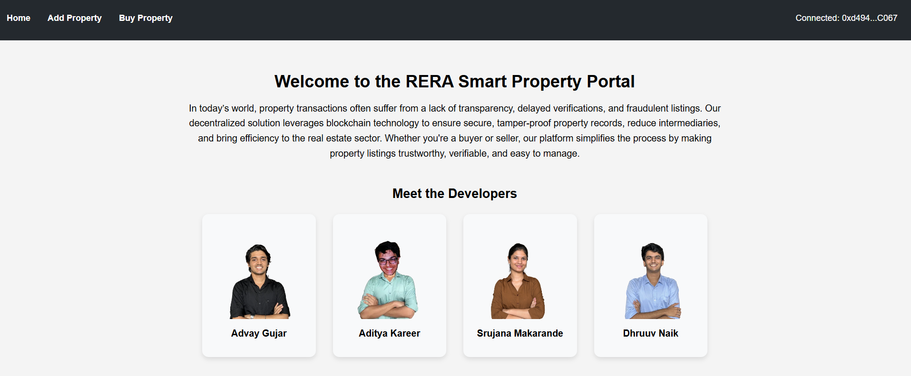
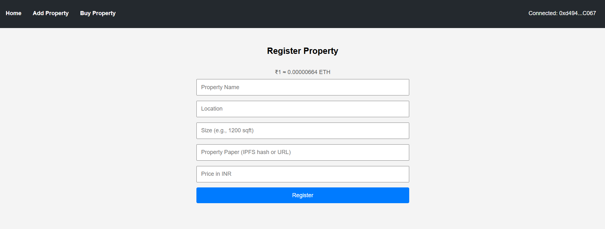
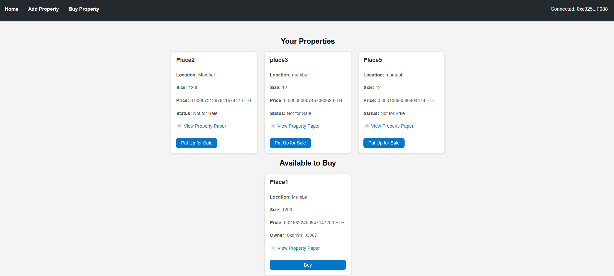

# 🏠 PropX Property Exchange Portal

## 📘 Description

The **PropX Property Exchange Portal** is a decentralized application (DApp) that brings transparency, authenticity, and ease of use to the real estate ecosystem. Built on blockchain technology, it allows users to register, buy, and resell properties in a secure and tamper-proof environment. This project ensures that ownership records remain immutable and that transactions are trustless and verifiable.

### 🔑 Why this is needed?

- ❌ Traditional real estate transactions often involve fraud, forged documents, and disputes.
- ✅ Blockchain ensures secure, traceable, and transparent property management.
- ✅ Buyers can verify ownership history, view legal documents, and perform transactions seamlessly.
- ✅ Property resale and availability can be toggled easily by the owner, bringing control back to the users.

---

## 📸 Screenshots / Demo

### 🔷 Home Page  


### 🔷 Add Property  


### 🔷 Buy Property  



---

## 🚀 How to Run

1. **Clone the repository**  
   ```bash
   git clone https://github.com/321dhruuv0037/PropX.git
   cd PropX
   ```

2. **Install dependencies**  
   ```bash
   npm install
   ```

3. **Start Ganache** and deploy the smart contract using Remix or Truffle.

4. **Start the React frontend**  
   ```bash
   npm start
   ```

5. Open [http://localhost:3000](http://localhost:3000) in your browser.

---

## 👨‍💻 Developers


| GitHub Profile | Name |
|----------------|------|
|  | [Dhruuv Naik](https://github.com/321dhruuv0037) |
|  | [Srujana Makarande](https://github.com/srujana2310) |
|  | [Advay Gujar](https://github.com/advayGujar) |
|  | [Aditya Kareer](https://github.com/adityaKareer) |


